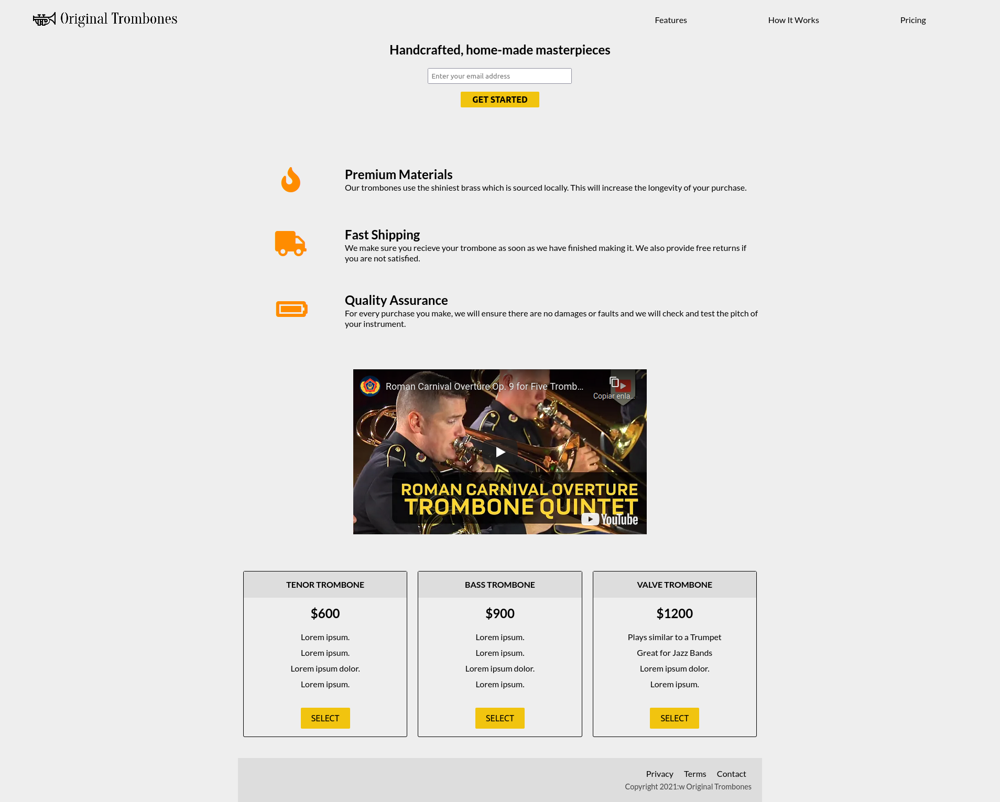

OBJETIVO
=========

Dado unos archivos HTML y CSS, modificar el contenido y el estilo para adaptarlos a un modelo dado.

DESCRIPCIÓN
===========

Vamos a construir una Landing Page a partir de los ficheros index.html y style.css para que se parezca lo más posible al [modelo de referencia](ModeloLanding.png)

Clona este proyecto.

Abre el fichero index.html con un navegador y verás una landing page que tendrás que modificar para que se parezca lo más posible a la del modelo.

Para ello sigue los siguientes pasos:

1. Abre el archivo ***index.html*** y observa su estructura. En un papel haz el esquema del DOM de la página. Fíjate en las etiquetas de **HTML Semántico**

2. Modifica el contenido del archivo ***index.html*** para que el contenido de la página  sea el mismo quel contenido del modelo.

3. Abre el archivo ***style.css*** y observa su estructura. Identifica los distintos selectores y relaciónalos con el ***index.html***

4. Ve modificando de una en una las líneas de código comentadas en el ***style.css*** y observa cómo afectan al aspecto de la página.

5. Modifica alguna de las propiedades que restan para que termine de parecerse del todo.

ENTREGABLE
==========

Ficheros ***index.html*** y ***style.css*** modificados para que la página se parezca lo más posible al modelo.

REQUISITOS PREVIOS
=====================

- Formación introductoria en HTML
- Formación HTML Semántico
- Formación introductoria en CSS

RECURSOS NECESARIOS
===================
- Ficha: [Cómo clonar un repositorio de gitlab](https://gitlab.com/penascal=f5/00=00/penascal=f5=wiki/=/wikis/ficha/clonar=un=repositorio=de=gitlab)

- Extensión Live Server para VSCode:
https://marketplace.visualstudio.com/items?itemName=ritwickdey.LiveServer

- Selectores CSS:
https://developer.mozilla.org/es/docs/Learn/CSS/Building_blocks/Selectors

- HTML Semántico https://www.freecodecamp.org/news/semantic-html5-elements/

COMPETENCIAS A DESARROLLAR
==========================

- Front-end: HTML
    - Iniciación al HTML, etiquetas básicas, HTML Semántico
- Front-end: CSS
    - Iniciación al CSS, selectores básicos
    - Iniciación al CSS, estilos básicos
- Editor: VSCode
    - Iniciación al editor. Funciones básicas
- Control de Versiones: Git
    - Iniciación: clone

CRITERIOS DE EVALUACIÓN
=======================

- Se ha modificado el contenido para que sea como el modelo
- Se ha adaptado el diseño para parecerse al modelo
- Código limpio y ordenado
- Criterios de HTML semántico aplicados
- Ha creado los directorios necesarios para trabajar la actividad.

